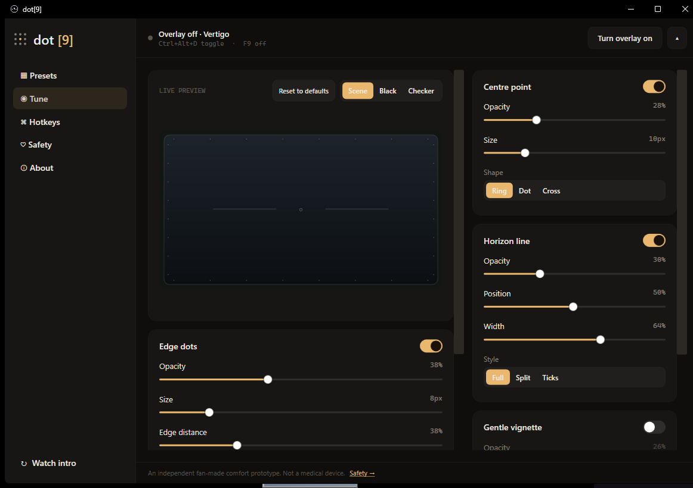
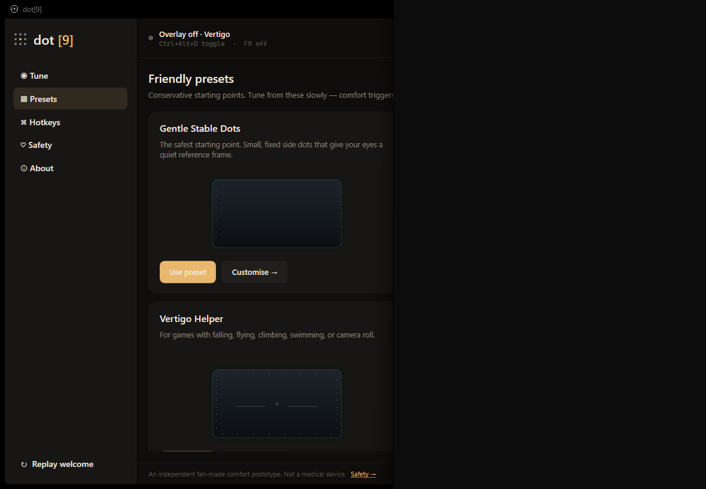
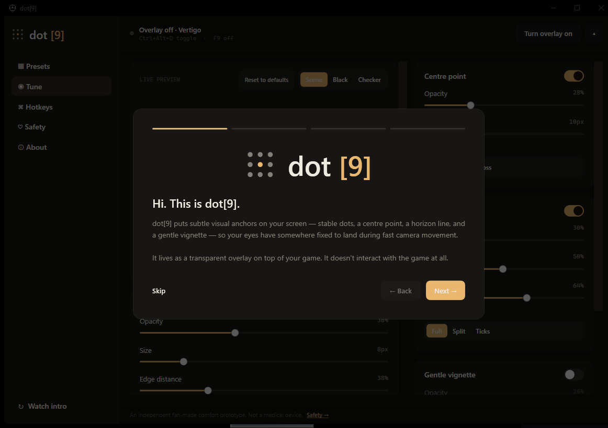

# Dot[9]

**Visual anchors for motion-heavy games.**

[](#download)
[](#download)
[](#privacy)
[](https://github.com/JGM-89/dot9/actions)

Dot[9] is a Windows accessibility comfort overlay for motion-heavy games, cybersickness, and video-game-induced motion discomfort.

It adds subtle visual anchors over the screen so your eyes have a stable reference while a game camera turns, falls, sprints, flies, shakes, or rolls. Some players may find that a quiet, screen-fixed reference frame makes long play sessions more comfortable.

Dot[9] is an independent fan-made comfort tool inspired by a love of thoughtful gaming tools.

## Screenshots







## At A Glance

- **For:** players who get motion sick, dizzy, or uncomfortable in fast-moving games.
- **Does:** draws configurable screen-fixed dots, centre point, horizon line, and gentle vignette cues.
- **Does not:** inject into games, hook game memory, automate input, collect telemetry, or claim medical treatment.
- **Best with:** windowed or borderless fullscreen games on Windows 10/11.

## What It Tries To Solve

Video-game-induced motion sickness and cybersickness can happen when your eyes see strong virtual motion while your body and inner ear feel still. Dot[9] explores a gentle accessibility idea: stable, configurable visual cues may help some players separate game-camera motion from the physical screen.

Dot[9] is science-informed and user-tunable, but it is a comfort tool, not a medical treatment.

## Science-Informed Rationale

Motion sickness and cybersickness are often discussed as a sensory conflict problem: the visual system reports motion while the body and inner ear report stillness. Games can create that mismatch during fast camera turns, sprinting, falling, flying, swimming, camera shake, or wide-FOV movement.

Dot[9] starts from a cautious hypothesis: stable, screen-fixed visual anchors may help some players by giving the visual system a fixed reference frame. The feature hierarchy is intentionally conservative: stable edge dots first, then optional centre point, horizon line, and gentle vignette. Effects vary between people, so presets are starting points rather than promises.

## Features

- Transparent, always-on-top Windows overlay
- Click-through by default, so games still receive mouse and keyboard input
- Stable edge dots
- Dot size, opacity, colour palette, shape, edge selection, and distance controls
- Monitor selection for all monitors, primary monitor, or one specific display
- Optional centre point with size, opacity, colour, and shape controls
- Optional Horizon Line with side tick, segmented, and full-line styles
- Optional Gentle Vignette for reducing peripheral visual intensity
- Live settings preview with reset-to-defaults
- Friendly presets: Gentle, FPS, Vertigo, Fast Motion
- Configurable global hotkeys with keystroke capture (click to assign any key combination)
- System tray toggle with quick preset switcher
- Local settings persistence
- Safety and privacy copy in the app

## Download

The normal way to use Dot[9] is to download the Windows build from GitHub Releases:

1. Open the latest release: https://github.com/JGM-89/dot9/releases
2. Download `Dot9-win-x64.zip`.
3. Extract the ZIP.
4. Run `Dot9.exe`.

GitHub Actions builds the release ZIP on Windows whenever `main` is updated.

## Use

1. Launch `Dot9.exe`.
2. Start with the Gentle preset.
3. Use the live preview to tune dot visibility.
4. Pick the monitor you want the overlay on.
5. Turn the overlay on before launching or focusing a game.
6. If anything feels worse, press your off shortcut (F9 by default) and stop playing if symptoms are strong.

## Default Hotkeys

- Toggle overlay: `Ctrl+Alt+D`
- Off shortcut: `F9`

You can assign any key combination in the Hotkeys view — click the binding button and press your shortcut.

## Developer Build

Most users do not need this. To build from source, install the .NET 10 SDK for Windows desktop development, then run:

```powershell
dotnet build .\Dot9.sln
```

For a local clickable build:

```powershell
dotnet publish .\src\Dot9\Dot9.csproj -c Release -r win-x64 --self-contained true -p:PublishSingleFile=true -p:EnableCompressionInSingleFile=true -o .\artifacts\Dot9-win-x64 --configfile .\NuGet.Config
```

Do not commit `artifacts/`, `bin/`, or `obj/`.

## Safety Note

Dot[9] may help some players, but it does not cure, prevent, diagnose, or treat motion sickness, vertigo, migraine, vestibular disorders, or any medical condition. Avoid high contrast and rapid animation. Stop playing if you feel strong nausea, dizziness, headache, or disorientation.

## Privacy

Dot[9] works offline. It collects no telemetry and sends no game names, usage data, health-related settings, profile data, or hardware data anywhere by default. Settings are stored locally in the user's application data folder.

## Rights

Dot[9] is publicly visible for transparency and collaboration, but it is not currently open source. No reuse license is granted. See [NOTICE.md](NOTICE.md).

## Limitations

- Dot[9] 1.0 focuses on stable, screen-fixed comfort cues.
- Some exclusive fullscreen games may render above normal desktop overlays. If the overlay disappears when a game opens, try borderless fullscreen or windowed fullscreen first.
- Some borderless games can still move above normal desktop overlays when they launch or change renderer state. Dot[9] includes a compatibility watch that reasserts topmost placement without focusing the app.
- Games running as administrator may appear above Dot[9] unless Dot[9] is launched with matching permissions.
- Multi-monitor coverage has a monitor picker, but unusual mixed-DPI layouts may still need refinement.
- Counter-motion, profiles, onboarding, installer packaging, and in-app auto-update are roadmap items beyond 1.0.

## Roadmap

- Counter-Motion and Motion Echo modes using normal OS-level mouse delta only
- Adaptive Comfort mode
- First-run onboarding
- Comfort Profiles with import/export
- Better multi-monitor and DPI refinement
- Signed installer and in-app automatic updates
